# Universidad Tecnológica de Panamá
## Facultad de Ingeniería de Sistemas Computacionales
**Campus Víctor Levis Sasso**
**Laboratorio:** DESARROLLO WEB – SUBIR ARCHIVOS (Taller Aspirantes)
**Fecha de Ejecución:** 7 de octubre de 2026

---

## 📑 Contenido

1. [Objetivos](#-objetivos)
2. [Introducción](#-introducción)
3. [Insertar registros (Imágenes)](#1--insertar-registros-imágenes)
4. [Evidencia de acciones de Modificar (Imágenes)](#2--evidencia-de-acciones-de-modificar-imágenes)
5. [Evidencia de acciones de Eliminar (Imágenes)](#3--evidencia-de-acciones-de-eliminar-imágenes)
6. [Controles utilizados](#4--controles-utilizados)
7. [Detalles del laboratorio](#5--detalles-del-laboratorio)
8. [Procesos de instalación](#6--procesos-de-instalación)
9. [Tecnologías y versiones](#7--tecnologías-y-versiones)
10. [Detalles del autor, fecha y referencias](#8--detalles-del-autor-fecha-y-referencias)

---

## 🎯 Objetivos

* Comprender la importancia de la documentación en proyectos de desarrollo web.
* Implementar un formulario web interactivo en PHP para la carga y gestión de archivos/imágenes.
* Consolidar el uso de buenas prácticas de seguridad (sanitización de datos con `htmlspecialchars` y validación de campos/extensiones).
* Aplicar una estructura modular con hojas de estilo, pie de página, encabezado y navegación estandarizada.

---

## 📝 Introducción

En este laboratorio se desarrolló un sistema de registro para aspirantes (`PortalU`) utilizando PHP, HTML, CSS y Apache. El objetivo principal consiste en permitir la recolección de datos del aspirante junto con la carga segura de su fotografía de perfil a un servidor local.

Durante el desarrollo se estructuraron las vistas separando los componentes comunes (encabezado y pie de página), se implementaron validaciones de archivos en el lado del servidor y se configuraron políticas de seguridad para el almacenamiento en disco.

> 📌 **Nota:** el sistema **no usa base de datos**: cada "registro" es el conjunto de datos del aspirante procesado por `procesar.php` más su fotografía guardada en `Uploaded_files/`. *Insertar* = registrar al aspirante, *Modificar* = corregir los datos y volver a registrar, *Eliminar* = borrar la fotografía y el registro con `eliminar.php`.

---

## 1. 📥 Insertar registros (Imágenes)

### 1.1 Formulario de registro de aspirantes (`index.php`)
Interfaz principal con los campos requeridos (nombre, apellido, identificación, fecha de nacimiento, sexo y fotografía).

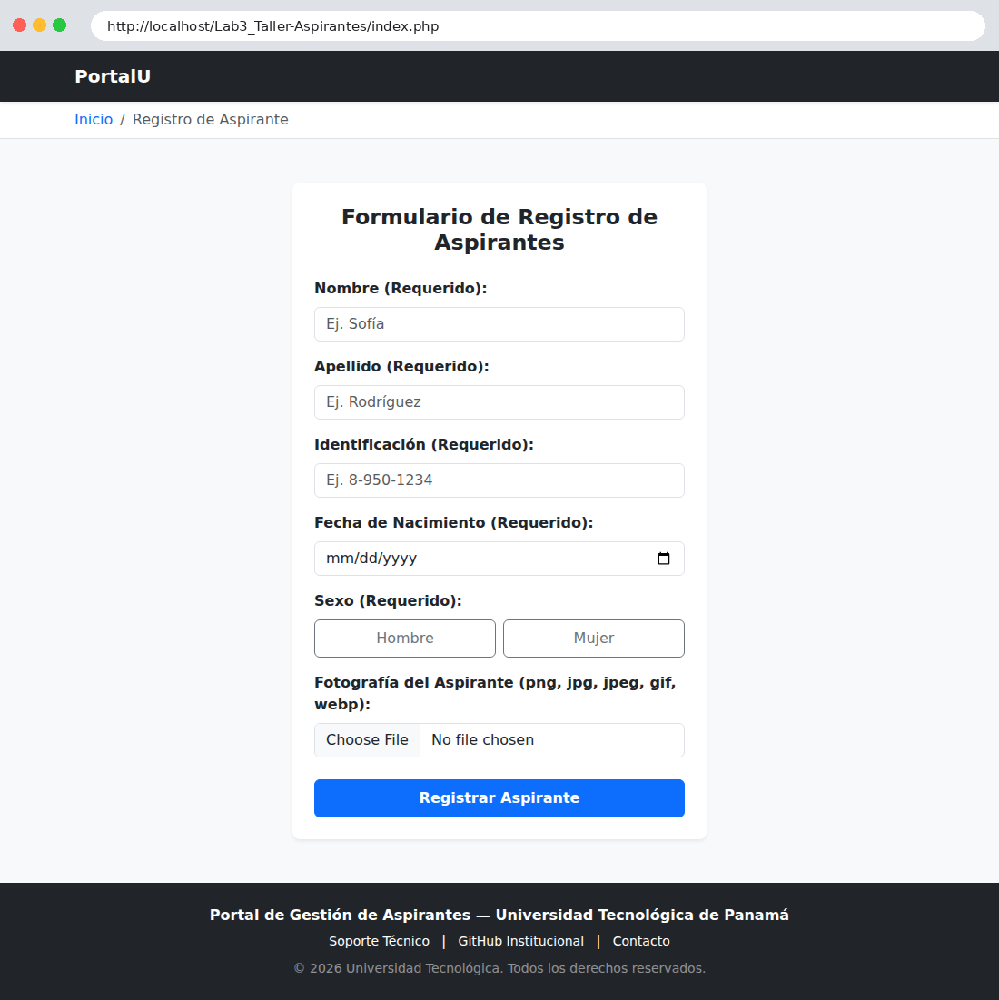

### 1.2 Formulario con los datos ingresados
Se ingresa el aspirante *norma rodriguez*, identificación `pe-12-345`, nacida el 14/05/1999 y se selecciona una fotografía.

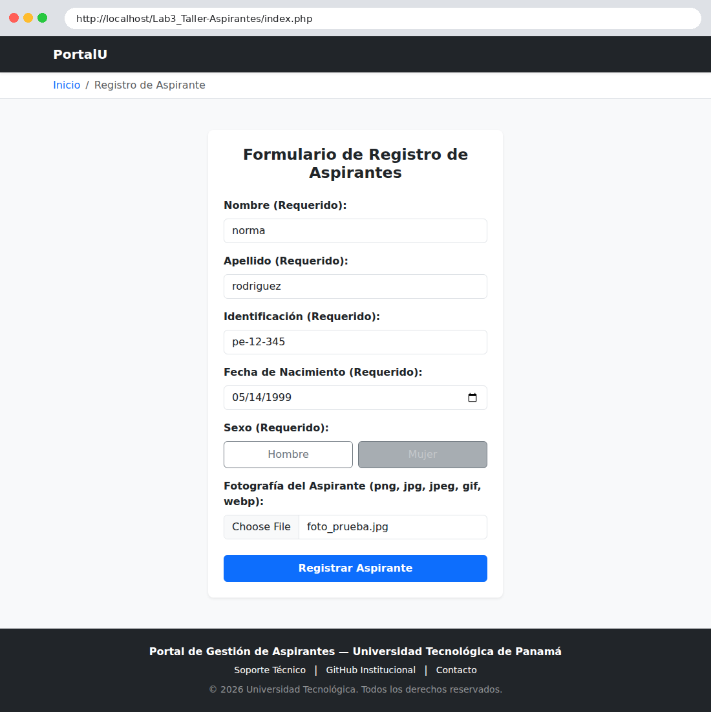

### 1.3 Registro exitoso (`procesar.php`)
Los datos se **normalizan automáticamente** (nombre en formato título e identificación en mayúsculas), se calcula la edad y se muestra la fotografía guardada con un nombre único.

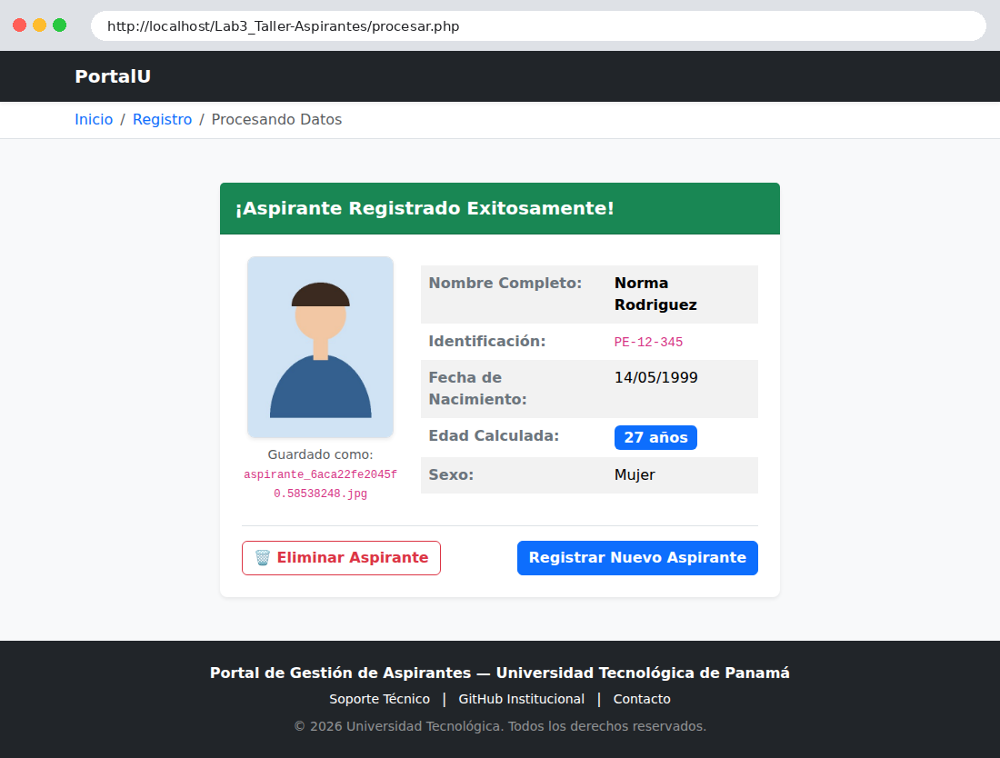

### 1.4 Fotografía almacenada en el servidor
Contenido de la carpeta `Uploaded_files/` antes y después de registrar al aspirante.

| Antes de registrar | Después de registrar |
|---|---|
| 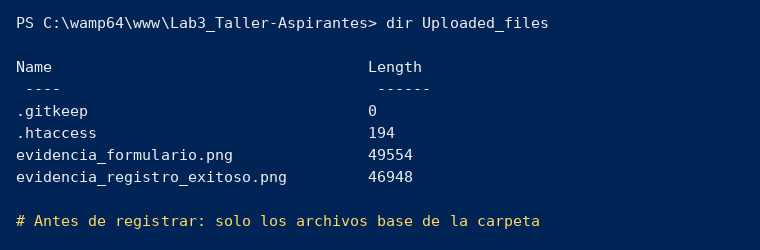 | 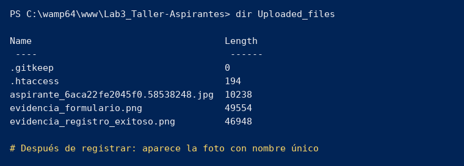 |

### 1.5 Validaciones del servidor
| Archivo con extensión no permitida (`.txt`) | Acceso directo a `procesar.php` sin enviar el formulario |
|---|---|
| 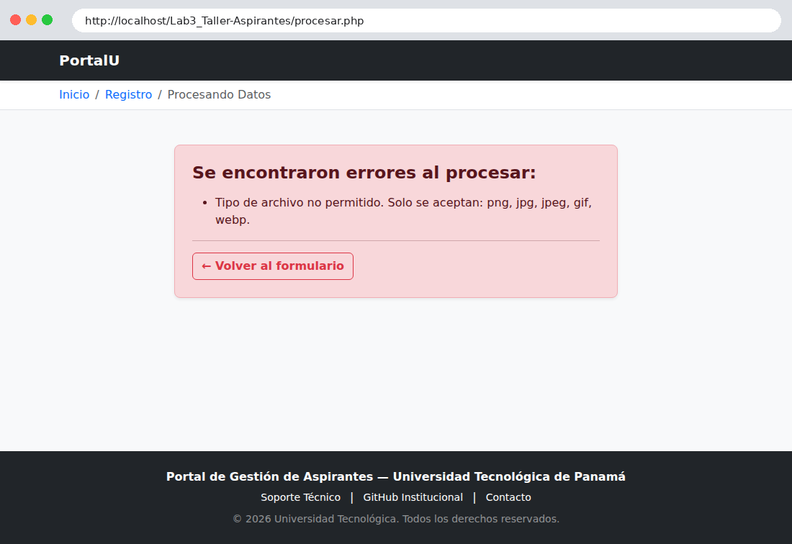 | 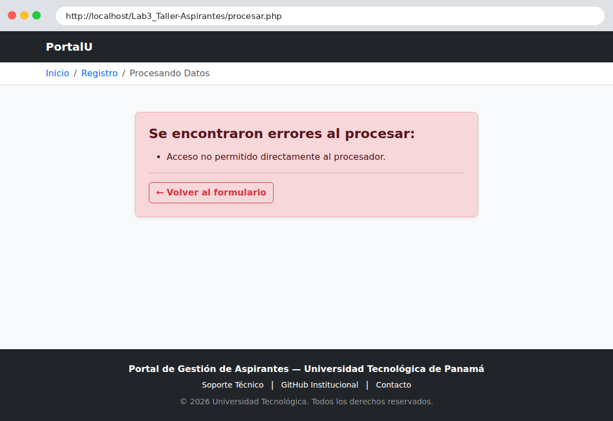 |

---

## 2. ✏️ Evidencia de acciones de Modificar (Imágenes)

El laboratorio no incluye una pantalla de edición independiente; la modificación se realiza **corrigiendo los datos tras una validación fallida y volviendo a registrar**.

**Paso 1 – Se ingresa una fecha de nacimiento no válida (edad de 11 años).** El sistema rechaza el registro:

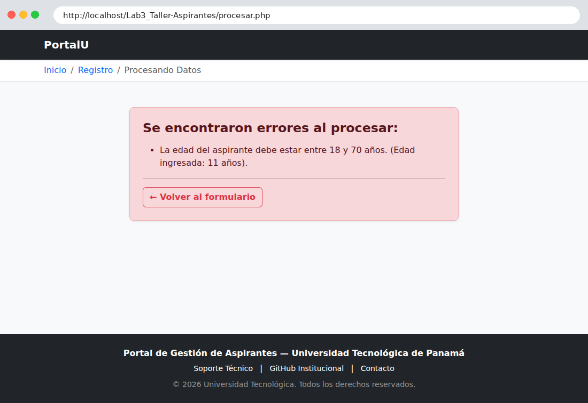

**Paso 2 – Se vuelve al formulario y se modifica la fecha** (de `2015` a `2001`):

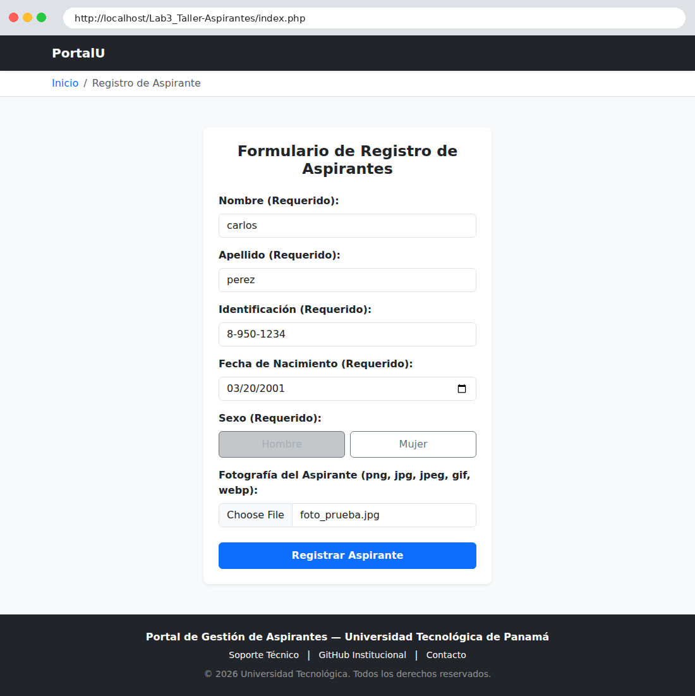

**Paso 3 – El registro se procesa con los datos corregidos** (edad calculada de 25 años):

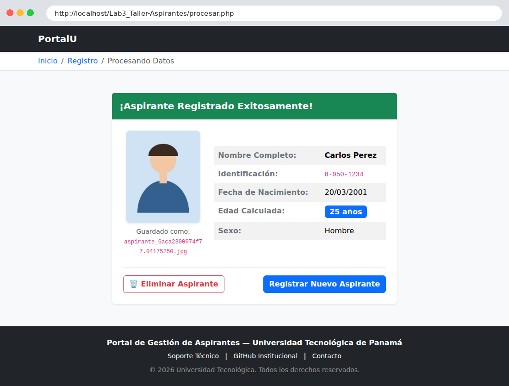

---

## 3. 🗑️ Evidencia de acciones de Eliminar (Imágenes)

Desde la pantalla de registro exitoso, el botón **🗑️ Eliminar Aspirante** pide confirmación (`confirm()`), envía la ruta de la foto a `eliminar.php`, borra el archivo con `unlink()` y redirige al formulario.

| Tras eliminar: redirección al formulario | Carpeta `Uploaded_files/` sin la fotografía |
|---|---|
|  | 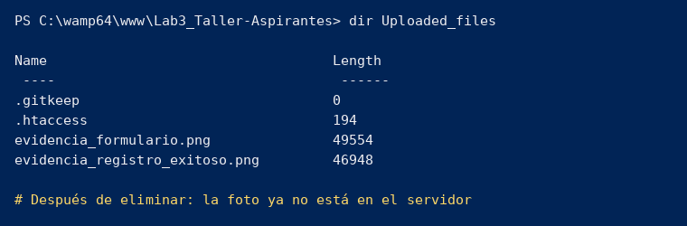 |

---

## 4. 🎛️ Controles utilizados

### Estructura modular del proyecto

```text
Lab3_Taller-Aspirantes/
├── Includes/
│   ├── header.php      # Encabezado principal, navbar y breadcrumb dinámico
│   └── footer.php      # Pie de página unificado
├── Uploaded_files/
│   ├── .htaccess       # Políticas de seguridad del directorio de carga
│   └── .gitkeep
├── imagenes/           # Capturas usadas en este README
├── index.php           # Formulario principal de Registro de Aspirantes
├── procesar.php        # Lógica del servidor (validaciones y carga de archivos)
├── eliminar.php        # Acción para remover imágenes subidas
└── README.md           # Documentación general del laboratorio
```

### Controles HTML (`index.php`)

| Control | Uso |
|---|---|
| `<form method="POST" enctype="multipart/form-data">` | Envía datos y archivo al servidor |
| `<input type="text">` | Nombre, apellido e identificación |
| `<input type="date">` | Fecha de nacimiento |
| `<input type="radio">` (estilo `btn-check`) | Sexo: Hombre / Mujer |
| `<input type="file" accept=".png,.jpg,.jpeg,.gif,.webp">` | Fotografía del aspirante |
| `<button type="submit">` | Registrar aspirante |
| `<input type="hidden" name="foto_ruta">` | Ruta de la foto a eliminar |
| Atributos `required`, `placeholder`, `label for` | Validación y accesibilidad |
| `onsubmit="return confirm(...)"` (JavaScript) | Confirmación antes de eliminar |
| Bootstrap 5.3: `navbar`, `breadcrumb`, `card`, `alert`, `table`, `badge` | Interfaz y diseño responsivo |

### Controles PHP

| Archivo | Funciones / controles |
|---|---|
| `procesar.php` | `$_POST`, `$_FILES`, `isset()`, `empty()`, `trim()`, `strip_tags()`, `htmlspecialchars()`, `ucwords(strtolower())`, `strtoupper()`, `DateTime` + `diff()` (edad entre 18 y 70), `pathinfo()`, `in_array()`, `uniqid()`, `is_dir()`, `mkdir()`, `move_uploaded_file()`, `try / catch` |
| `eliminar.php` | `strpos()` (valida que la ruta esté en la carpeta de cargas), `file_exists()`, `unlink()`, `header("Location: ...")` |
| `Includes/header.php` y `footer.php` | `include`, `basename($_SERVER['PHP_SELF'])` para el breadcrumb dinámico, `date('Y')` |
| `Uploaded_files/.htaccess` | `Options -Indexes` y bloqueo de ejecución de `.php`, `.phtml`, `.php5` |

---

## 5. 🧪 Detalles del laboratorio

| Característica | Detalle |
|---|---|
| **Nombre** | Taller Aspirantes – Subir archivos |
| **Objetivo** | Registrar aspirantes con datos personales y fotografía, validando todo en el servidor |
| **Campos** | Nombre, apellido, identificación, fecha de nacimiento, sexo y fotografía |
| **Reglas de validación** | Todos los campos obligatorios · edad entre 18 y 70 años · extensiones permitidas: `png`, `jpg`, `jpeg`, `gif`, `webp` |
| **Normalización** | Nombre y apellido en formato título · identificación en mayúsculas |
| **Seguridad** | Saneamiento con `htmlspecialchars` y `strip_tags` · nombre único para cada foto · `.htaccess` que impide ejecutar scripts en `Uploaded_files/` · eliminación restringida a la carpeta de cargas |
| **Acciones** | Registrar · Corregir y volver a registrar · Eliminar aspirante y fotografía |
| **Instructor** | Ing. Irina Fong |

### ⚠️ Dificultades y soluciones

* **Problema:** error al procesar la carga de la imagen por restricciones en el tipo de contenido.
  **Solución:** verificación estricta de extensiones permitidas (`png`, `jpg`, `jpeg`, `gif`, `webp`) en `procesar.php` antes de mover la imagen a `Uploaded_files/`.
* **Problema:** inconsistencia en la codificación de caracteres especiales al desplegar las respuestas del servidor.
  **Solución:** se aplicó `htmlspecialchars()` a las cadenas capturadas por `$_POST` para prevenir ataques XSS y asegurar la correcta visualización del texto.

---

## 6. ⚙️ Procesos de instalación

1. **Instalar un entorno local** con Apache y PHP: WampServer (Windows) o XAMPP. Iniciar los servicios hasta que el ícono quede en **verde**.
2. **Instalar Visual Studio Code** y **Git**.
3. **Clonar el repositorio** en la carpeta `www` (WampServer) o `htdocs` (XAMPP):
   ```bash
   git clone https://github.com/jazidsanchez-create/Lab3_Taller-Aspirantes.git
   cd Lab3_Taller-Aspirantes
   ```
4. **Verificar permisos de escritura** en la carpeta `Uploaded_files/`.
5. **Abrir la aplicación** en el navegador:
   ```text
   http://localhost/Lab3_Taller-Aspirantes/index.php
   ```

> 💡 El diseño usa Bootstrap por CDN, por lo que se necesita conexión a internet para ver los estilos.

---

## 7. 🌐 Tecnologías y versiones


| Tecnología | Versión |
|---|---|
| PHP | 8.0 o superior *(capturas generadas con PHP 8.3; verifica la tuya con `php -v`)* |
| Apache | 2.4.x *(incluido en WampServer / XAMPP)* |
| WampServer | 3.x |
| HTML / CSS | HTML5 / CSS3 |
| Bootstrap | 5.3.3 (CDN) |
| JavaScript | ES6 (`confirm()` para la confirmación de eliminación) |
| Visual Studio Code | Última versión estable |
| Git / GitHub | Git 2.x |
| Sistema operativo | Windows 10 / 11 · Linux · macOS |

---

## 8. 👨‍💻 Detalles del autor, fecha y referencias

**Estudiante:** Jazid Sánchez
**Carrera:** Licenciatura en Ciberseguridad
**Institución:** Universidad Tecnológica de Panamá
**Facultad:** Facultad de Ingeniería de Sistemas Computacionales
**Instructor:** Ing. Irina Fong

📧 **Email:** jazid.sanchez@utp.ac.pa
🌐 **GitHub:** https://github.com/jazidsanchez-create

📅 **Fecha de ejecución:** 7 de octubre de 2026
📅 **Última actualización del README:** 10 de octubre de 2026

### 📚 Referencias

* PHP Documentation Group. (2026). *PHP Manual: Handling file uploads*. https://www.php.net/manual/en/features.file-upload.php
* W3Schools. (2026). *PHP Form Handling and Security*. https://www.w3schools.com/php/php_forms.asp
* PHP Documentation Group. (2026). *DateTime::diff*. https://www.php.net/manual/en/datetime.diff.php
* Bootstrap. (2026). *Bootstrap 5.3 Documentation*. https://getbootstrap.com/docs/5.3/
* Apache Software Foundation. (2026). *Apache HTTP Server: .htaccess files*. https://httpd.apache.org/docs/2.4/howto/htaccess.html
